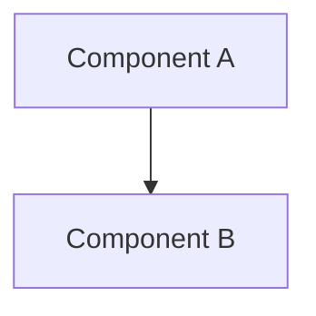

# Documentation Template Collection

**Template Usage General Instructions:**
1. Replace `[...]` content with actual content
2. **Language Specification:** Strictly follow G1 rules. Except for exception list, all content generated in {OUTPUT_LANGUAGE}

---

## A1 | Knowledge Base Documentation Templates

### CHANGELOG.md

```markdown
# Changelog

This file records all important project changes.
Format based on [Keep a Changelog](https://keepachangelog.com/zh-CN/1.0.0/),
version numbers follow [Semantic Versioning](https://semver.org/lang/zh-CN/).

## [Unreleased]

## [Version] - YYYY-MM-DD

### Added
- [New feature description]

### Changed
- [Change description]

### Fixed
- [Fix description]

### Removed
- [Removal description]
```

---

### history/index.md

```markdown
# Change History Index

This file records index of all completed changes for traceability and query.

---

## Index

| Timestamp | Feature Name | Type | Status | Solution Package Path |
|-----------|--------------|------|--------|----------------------|
| YYYYMMDDHHMM | [Feature ID] | [Feature/Fix/Refactor] | ✅Completed/[-]Not Executed | [Link] |

---

## Archive by Month

### YYYY-MM

- [YYYYMMDDHHMM_feature](YYYY-MM/YYYYMMDDHHMM_feature/) - [One-line feature description]
```

---

### wiki/overview.md

```markdown
# [Project Name]

> This file contains project-level core information. Detailed module documentation in `modules/` directory.

---

## 1. Project Overview

### Goals and Background
[Brief project goals and background]

### Scope
- **In scope:** [Core feature boundaries]
- **Out of scope:** [Explicitly not included]

### Stakeholders
- **Owner:** [Name/Role]

---

## 2. Module Index

| Module Name | Responsibility | Status | Documentation |
|-------------|----------------|--------|---------------|
| [Module] | [Core responsibility] | [Stable/In Development] | [Link] |

---

## 3. Quick Links
- [Technical Conventions](../project.md)
- [Architecture Design](arch.md)
- [API Manual](api.md)
- [Data Models](data.md)
- [Change History](../history/index.md)
```

---

### wiki/arch.md

```markdown
# Architecture Design

## Overall Architecture


## Tech Stack
- **Backend:** [Language/Framework]
- **Frontend:** [Framework/Library]
- **Data:** [Database/Storage]

## Core Flow
```mermaid
sequenceDiagram
    Participant->>System: Action
```

## Major Architecture Decisions
Complete ADRs stored in each change's how.md, this section provides index.

| adr_id | title | date | status | affected_modules | details |
|--------|-------|------|--------|------------------|---------|
| ADR-[Number] | [Title] | YYYY-MM-DD | ✅Adopted/❌Deprecated | [Module list] | [Link] |
```

---

### project.md

```markdown
# Project Technical Conventions

---

## Tech Stack
- **Core:** [Language version] / [Framework version]

---

## Development Conventions
- **Code Standards:** [Reference standards or brief description]
- **Naming Conventions:** [e.g., camelCase/snake_case]

---

## Errors and Logging
- **Strategy:** [Unified error handling approach]
- **Logging:** [Level and format requirements]

---

## Testing and Process
- **Testing:** [Unit/integration test requirements]
- **Commit:** [Commit Message specification]
```

---

### wiki/api.md

```markdown
# API Manual

## Overview
[Overall API description]

## Authentication Method
[Authentication mechanism description]

---

## API List

### [Module Name]

#### [METHOD] [Path]
**Description:** [Functionality]

**Request Parameters:**
| Parameter | Type | Required | Description |
|-----------|------|----------|-------------|
| [Param] | [Type] | [Yes/No] | [Description] |

**Response:**
```json
{
  "code": 0,
  "data": {}
}
```

**Error Codes:**
| Error Code | Description |
|------------|-------------|
| [code] | [Description] |
```

---

### wiki/data.md

```markdown
# Data Models

## Overview
[Overall data architecture description]

---

## Data Tables/Collections

### [Table/Collection Name]

**Description:** [Usage description]

| Field | Type | Constraints | Description |
|-------|------|-------------|-------------|
| [Field] | [Type] | [Primary Key/Not Null/Unique, etc.] | [Description] |

**Indexes:**
- [Index name]: [Field list]

**Relationships:**
- [Relationship description]
```

---

### wiki/modules/<module>.md

**Status options:** ✅Stable / 🚧In Development / 📝Planning

```markdown
# [Module Name]

## Purpose
[One-line module purpose]

## Module Overview
- **Responsibility:** [Detailed responsibility description]
- **Status:** [Status icon]
- **Last Updated:** YYYY-MM-DD

## Specifications

<!-- 🔁 Repeat the following format for each requirement -->
### Requirement: [Requirement Name]
**Module:** [Current module name]
[Requirement description]

#### Scenario: [Scenario Name]
[Preconditions]
- [Expected result 1]
- [Expected result 2]
<!-- Loop end -->

## API Interfaces
<!-- Fill if APIs exist -->
### [METHOD] [Path]
**Description:** [Functionality]
**Input:** [Parameters]
**Output:** [Response]

## Data Models
<!-- Fill if data tables exist -->
### [Table/Model Name]
| Field | Type | Description |
|-------|------|-------------|
| [Field] | [Type] | [Description] |

## Dependencies
- [Dependent module list]

## Change History
- [YYYYMMDDHHMM_feature](../../history/YYYY-MM/...) - [Change brief]
```

---

## A2 | Solution File Templates

### why.md in plan/ and history/

**Logic Control:** `Product Analysis` section only generated when G8 (Product Design Principles) triggered, otherwise omit.

```markdown
# Change Proposal: [Feature Name]

## Requirement Background
[Describe current state, pain points, and change drivers]

<!-- ⚠️ Only generate this section when G8 triggered -->
## Product Analysis

### Target Users and Scenarios
- **User Groups:** [Characteristic description]
- **Usage Scenarios:** [Specific scenario description]
- **Core Pain Points:** [Problems to solve]

### Value Proposition and Success Metrics
- **Value Proposition:** [Core value]
- **Success Metrics:** [Quantifiable metrics]

### Humanistic Care
[Inclusivity/Privacy/Ethical considerations]
<!-- Product Analysis section end -->

## Change Content
1. [Change point 1]
2. [Change point 2]

## Impact Scope
- **Modules:** [List]
- **Files:** [List]
- **APIs:** [List]
- **Data:** [List]

## Core Scenarios

<!-- 🔁 Repeat the following format for each requirement -->
### Requirement: [Requirement Name]
**Module:** [Owning module name]
[Requirement brief]

#### Scenario: [Scenario Name]
[Condition description]
- [Expected result]
<!-- Loop end -->

## Risk Assessment
- **Risk:** [Description]
- **Mitigation:** [Measures]
```

---

### how.md in plan/ and history/

```markdown
# Technical Design: [Feature Name]

## Technical Solution
### Core Technologies
- [Language/Framework/Library]

### Implementation Key Points
- [Key logic 1]
- [Key logic 2]

## Architecture Design
<!-- If architecture changes -->
```mermaid
flowchart TD
    [Chart code]
```

## Architecture Decision ADR
<!-- If involves architecture decisions, otherwise omit -->
### ADR-[Number]: [Decision Title]
**Context:** [Background and problem]
**Decision:** [Core decision]
**Rationale:** [Reasons]
**Alternatives:** [Solution] → Rejection reason: [Reason]
**Impact:** [Consequences and risks]

## API Design
<!-- If API changes -->
### [METHOD] [Path]
- **Request:** [Structure]
- **Response:** [Structure]

## Data Model
<!-- If data changes -->
```sql
[SQL or Schema code]
```

## Security and Performance
- **Security:** [Measures]
- **Performance:** [Optimizations]

## Testing and Deployment
- **Testing:** [Strategy]
- **Deployment:** [Process]
```

---

### task.md in plan/ and history/

**Markdown anchor link format generated per actual section titles in why.md**

```markdown
# Task List: [Feature Name]

Directory: `helloagents/plan/YYYYMMDDHHMM_<feature>/`

---

## 1. [Core Feature Module Name]
- [ ] 1.1 Implement [specific functionality] in `path/to/file.ts`, verify why.md#[requirement-title-anchor]-[scenario-title-anchor]
- [ ] 1.2 Implement [specific functionality] in `path/to/file.ts`, verify why.md#[requirement-title-anchor]-[scenario-title-anchor], depends on task 1.1

## 2. [Secondary Feature Module Name]
- [ ] 2.1 Implement [specific functionality] in `path/to/file.ts`, verify why.md#[requirement-title-anchor]-[scenario-title-anchor], depends on task 1.2

## 3. Security Check
- [ ] 3.1 Execute security check (per G9: input validation, sensitive info handling, permission control, EHRB risk avoidance)

## 4. Documentation Update
- [ ] 4.1 Update <knowledge base file>

## 5. Testing
- [ ] 5.1 Implement scenario test in `tests/integration/xxx.test.ts`: [Scenario 1 name], verification points: [key verification point list]
```

**Task Status Symbols:** Follow G11 definition

---

## A3 | Version Number Parsing Rules

### Multi-Language Version Number Sources (Priority: Primary > Secondary)

| Language/Framework | Primary Source | Secondary Source |
|-------------------|----------------|------------------|
| JavaScript/TypeScript | package.json → version | index.js/ts → VERSION constant |
| Python | pyproject.toml → [project].version | setup.py/__init__.py → __version__ |
| Java(Maven) | pom.xml → \<version\> | - |
| Java(Gradle) | gradle.properties/build.gradle → version | - |
| Go | Git tag | - |
| Rust | Cargo.toml → [package].version | - |
| .NET | .csproj → \<Version\>/\<AssemblyVersion\> | - |
| C/C++ | CMakeLists.txt → project(...VERSION) | Header file → #define PROJECT_VERSION |

**Purpose:** Referenced by G7 version management rules to determine version number file locations for projects in each language.
