# HelloAGENTS

<div align="center">

**Intelligent Workflow System - Your autonomous advanced intelligent partner that analyzes, implements, and validates until completion.**

[](./helloagents/CHANGELOG.md)
[](./CONTRIBUTING.md)

</div>

<p align="center">
  <a href="./README.md"></a>
  <a href="./README_CN.md"></a>
</p>

---

## 📑 Table of Contents

<details>
<summary><strong>Click to expand</strong></summary>

- [🎯 Why HelloAGENTS?](#-why-helloagents)
- [✨ Features](#-features)
- [🚀 Quick Start](#-quick-start)
- [🔧 How It Works](#-how-it-works)
- [📖 Documentation](#-documentation)
- [❓ FAQ](#-faq)
- [🛠️ Troubleshooting](#-troubleshooting)
- [🆚 Comparison with Other Approaches](#-comparison-with-other-approaches)
- [📈 Version History](#-version-history)
- [🔒 Security](#-security)
- [🙏 Acknowledgments](#-acknowledgments)

</details>

---

## 🎯 Why HelloAGENTS?

**Problem:** AI coding assistants often stop at analysis or generate inconsistent outputs without structured workflow management.

**Solution:** HelloAGENTS provides an intelligent workflow system with 3-layer routing, 4-stage workflow, and 3-layer acceptance to ensure production-ready results.

| Challenge | Without HelloAGENTS | With HelloAGENTS |
|-----------|---------------------|------------------|
| **Inconsistent Output** | Varies by prompt quality | Unified format with G3 output rules |
| **Premature Termination** | Stops at analysis or partial implementation | Complete execution until verification |
| **No Quality Control** | Manual review required | 3-layer acceptance (Stage/Gate/Flow) |
| **Context Loss** | Forgets previous decisions | State variables + knowledge base sync |
| **Risk Management** | No safety checks | EHRB detection with 2-layer analysis |

### 💡 Best For

- ✅ **Developers** seeking structured AI-assisted development workflows
- ✅ **Teams** needing consistent code generation and documentation
- ✅ **Projects** requiring quality assurance and risk management
- ✅ **AI-assisted workflows** beyond just coding (documentation, analysis, planning)

### ⚠️ Not For

- ❌ Simple one-off code snippets (use direct AI prompts)
- ❌ Non-technical tasks without structured requirements
- ❌ Projects without version control

---

## ✨ Features

### 🎯 Core Capabilities

<table>
<tr>
<td width="50%">

**🧭 3-Layer Intelligent Routing**

- Context-aware conversation continuity
- Tool layer for SKILL/MCP/Plugin integration
- Intent analysis with complexity assessment

**Your benefit:** Automatic routing to the right workflow

</td>
<td width="50%">

**📚 4-Stage Workflow Engine**

- Evaluate → Analyze → Design → Develop
- Structured progression with quality gates
- Automatic knowledge base synchronization

**Your benefit:** Production-ready results every time

</td>
</tr>
<tr>
<td width="50%">

**⚡ 3-Layer Acceptance System**

- Stage-level validation
- Inter-stage quality gates
- Flow-level comprehensive review

**Your benefit:** Consistent quality assurance

</td>
<td width="50%">

**🛡️ EHRB Security Detection**

- Keyword-based first layer scanning
- Semantic analysis second layer
- Automatic workflow escalation on risk

**Your benefit:** Protected from high-risk operations

</td>
</tr>
</table>

### 📊 By the Numbers

- **3-Layer Routing** — Context → Tools → Intent hierarchical processing
- **4 Workflow Stages** — Complete development lifecycle coverage
- **12 Commands** — Full command set for all operations
- **44 Files** — Modular architecture with reference library

---

## 🚀 Quick Start

### Prerequisites

- AI CLI tool that supports AGENTS.md/CLAUDE.md configuration (Claude Code, Codex CLI, etc.)
- Git installed and configured

### Installation

**Step 1: Get HelloAGENTS**

```bash
git clone https://github.com/hellowind777/helloagents.git
cd helloagents
```

**Step 2: Copy files to your CLI configuration directory**

This project contains two parts that need to be placed in different locations:

| Source | Target | Description |
|--------|--------|-------------|
| `helloagents/AGENTS.md` | `<CLI_CONFIG_ROOT>/` | Main configuration file, place in config root |
| `helloagents/skills/helloagents/` | `<CLI_CONFIG_ROOT>/skills/helloagents/` | Skill package, place in skills subdirectory |

**How to determine your CLI config directory:**
- Claude Code: `~/.claude/`
- Codex CLI: `~/.codex/`
- Other tools: refer to their documentation

**Example (Claude Code on macOS/Linux):**

```bash
cp helloagents/AGENTS.md ~/.claude/
cp -r helloagents/skills/helloagents ~/.claude/skills/
```

**Example (Claude Code on Windows PowerShell):**

```powershell
Copy-Item helloagents\AGENTS.md $env:USERPROFILE\.claude\
Copy-Item -Recurse helloagents\skills\helloagents $env:USERPROFILE\.claude\skills\
```

**Step 3: Verify Installation**

Restart your AI CLI and run:

```
~help
```

**Expected Output:**

```
💡【HelloAGENTS】- Help

### Available Commands

| Command | Function |
|---------|----------|
| ~auto | Full authorization mode |
| ~plan | Execute to design phase |
| ~exec | Execute solution package |
...

────
🔄 Next: Enter command or describe your requirement
```

### First Use Example

```bash
# 1. Get help and see available commands
"~help"

# 2. Start with full authorization mode
"~auto implement user authentication feature"

# 3. Or use planning mode first
"~plan add dark mode support"
```

---

## 🔧 How It Works

### Architecture Overview

```mermaid
flowchart TD
    Start([User Input]) --> L1{Layer 1: Context}

    L1 -->|"Continue External Tool"| ExtTool[🟣 External Tool]
    L1 -->|"Continue HelloAGENTS Task"| Resume[Resume Task]
    L1 -->|"New Request"| L2{Layer 2: Tools}

    L2 -->|"CLI Command"| CLI[Execute CLI]
    L2 -->|"HelloAGENTS Command"| Cmd[Process Command]
    L2 -->|"External Tool Match"| ExtTool
    L2 -->|"No Match"| L3{Layer 3: Intent}

    L3 -->|"Question/Chat"| Direct[💡 Direct Answer]
    L3 -->|"Change Request"| Eval[Evaluate Stage]

    Eval --> Score{Score ≥ 7?}
    Score -->|"No"| Ask[❓ Ask for Clarification]
    Ask --> Eval
    Score -->|"Yes"| Complex{Complexity?}

    Complex -->|"Simple"| Tweak[⚡ Tweak Mode]
    Complex -->|"Medium"| Light[🔄 Light Iteration]
    Complex -->|"Complex"| Standard[📋 Standard Dev]

    Tweak --> Done[✅ Complete]
    Light --> Analyze[Analyze] --> DesignL[Design] --> DevL[Develop] --> Done
    Standard --> AnalyzeS[Analyze] --> DesignS[Full Design] --> DevS[Develop] --> Done

    style Start fill:#e3f2fd
    style ExtTool fill:#ce93d8
    style Done fill:#4caf50,color:#fff
    style Tweak fill:#fff3e0
    style Light fill:#e8f5e9
    style Standard fill:#e3f2fd
```

<details>
<summary><strong>📊 Click to view full architecture diagram</strong></summary>



</details>

### Workflow Stages Explained

<table>
<tr><th>Stage</th><th>Function</th><th>Trigger</th><th>Output</th></tr>

<tr>
<td><strong>Evaluate</strong></td>
<td>
• Score requirement completeness<br>
• Ask clarifying questions<br>
• Assess complexity
</td>
<td>Any change request</td>
<td>
• Requirement score (≥7 to proceed)<br>
• Complexity assessment<br>
• Workflow mode selection
</td>
</tr>

<tr>
<td><strong>Analyze</strong></td>
<td>
• Scan project structure<br>
• Identify tech stack<br>
• Check knowledge base
</td>
<td>Score ≥ 7</td>
<td>
• Project context<br>
• Module dependencies<br>
• KB status
</td>
</tr>

<tr>
<td><strong>Design</strong></td>
<td>
• Create solution package<br>
• Define task breakdown<br>
• Risk assessment
</td>
<td>Analysis complete</td>
<td>
• proposal.md<br>
• tasks.md<br>
• Solution package
</td>
</tr>

<tr>
<td><strong>Develop</strong></td>
<td>
• Execute tasks<br>
• Generate code<br>
• Run validations
</td>
<td>Design approved</td>
<td>
• Code changes<br>
• Test results<br>
• KB sync
</td>
</tr>

</table>

> **Note:** Tweak Mode is an execution mode for simple changes, not a workflow stage. It bypasses the full 4-stage workflow for quick single-point modifications.

---

## 📖 Documentation

### Core Concepts

<table>
<tr><th>Concept</th><th>Definition</th><th>Importance</th></tr>

<tr>
<td><strong>Solution Package</strong></td>
<td>A folder containing proposal.md and tasks.md for a feature</td>
<td>Central unit of work tracking</td>
</tr>

<tr>
<td><strong>Knowledge Base</strong></td>
<td>helloagents/ directory with project documentation</td>
<td>Single source of truth for project knowledge</td>
</tr>

<tr>
<td><strong>EHRB Detection</strong></td>
<td>Extremely High Risk Behavior detection system</td>
<td>Prevents dangerous operations</td>
</tr>

<tr>
<td><strong>3-Layer Acceptance</strong></td>
<td>Stage/Gate/Flow validation hierarchy</td>
<td>Quality assurance at every level</td>
</tr>

</table>

### Commands Reference

| Command | Mode | Use Case | Example |
|---------|------|----------|---------|
| `~auto` | Full Authorization | End-to-end execution | `~auto add login feature` |
| `~plan` | Planning Mode | Design only, no execution | `~plan refactor auth module` |
| `~exec` | Direct Execution | Execute existing package | `~exec` |
| `~init` | KB Management | Initialize knowledge base | `~init` |
| `~upgrade` | KB Management | Upgrade knowledge base | `~upgrade` |
| `~clean` | Maintenance | Clean leftover packages | `~clean` |
| `~commit` | Git Operation | Commit with detection | `~commit` |
| `~test` | Validation | Run project tests | `~test` |
| `~review` | Quality | Code review | `~review` |
| `~validate` | Quality | Validate KB structure | `~validate` |
| `~rollback` | Recovery | Smart rollback | `~rollback` |
| `~help` | Information | Show help menu | `~help` |

### Configuration

**Global Settings (in AGENTS.md):**

```yaml
OUTPUT_LANGUAGE: zh-CN          # Output language
ENCODING: UTF-8                 # File encoding
KB_CREATE_MODE: 2               # KB mode: 0=OFF, 1=ON_DEMAND, 2=AUTO_FOR_CODING, 3=ALWAYS
BILINGUAL_COMMIT: 1             # Bilingual commits: 0=single, 1=bilingual
```

**KB Create Modes:**
- `0 (OFF)`: Skip all KB operations
- `1 (ON_DEMAND)`: Create KB only when explicitly requested
- `2 (ON_DEMAND_AUTO_FOR_CODING)`: Auto-create for coding tasks (default)
- `3 (ALWAYS)`: Always create/update KB

---

## ❓ FAQ

<details>
<summary><strong>Q: How does HelloAGENTS differ from using raw AI prompts?</strong></summary>

**A:** HelloAGENTS provides:
- Structured 4-stage workflow vs. ad-hoc responses
- 3-layer routing for intelligent request handling
- Quality gates and acceptance criteria
- Knowledge base for context persistence
- EHRB security detection
</details>

<details>
<summary><strong>Q: Can I use HelloAGENTS with any AI CLI tool?</strong></summary>

**A:** Yes, HelloAGENTS is designed to work with any AI CLI that supports agent/skill loading:
- Claude Code
- Codex CLI
- Gemini CLI
- And other compatible tools
</details>

<details>
<summary><strong>Q: What's the difference between ~auto and ~plan?</strong></summary>

**A:**
- `~auto`: Full authorization mode - executes through all stages silently until completion
- `~plan`: Planning mode - stops after design phase for review before execution
</details>

<details>
<summary><strong>Q: Do I need to initialize the knowledge base first?</strong></summary>

**A:** Not necessarily. With `KB_CREATE_MODE: 2` (default), the knowledge base is auto-created for coding tasks. You can also use `~init` to explicitly create it.
</details>

<details>
<summary><strong>Q: How do I handle leftover solution packages?</strong></summary>

**A:** Use `~clean` to scan and clean up incomplete or abandoned solution packages in the plan/ directory.
</details>

<details>
<summary><strong>Q: What triggers EHRB detection?</strong></summary>

**A:** EHRB detection triggers on:
- Production environment keywords (prod, production, live, master)
- Destructive operations (rm -rf, DROP TABLE, etc.)
- Irreversible operations (--force, --hard)
- Permission changes (chmod 777, sudo)
- Sensitive data patterns (password, api_key, etc.)
</details>

<details>
<summary><strong>Q: Can I customize the workflow?</strong></summary>

**A:** Yes, you can modify the reference modules in `references/` to customize stages, rules, and behaviors for your specific needs.
</details>

<details>
<summary><strong>Q: What's the difference between v1 and v2?</strong></summary>

**A:** Major differences:

| Aspect | v1 (2025-12) | v2 (2026-01) |
|--------|--------------|--------------|
| Positioning | AI Programming Partner | Intelligent Workflow System |
| Stages | 3 stages | 4 stages (+ Evaluate) |
| Routing | Simple | 3-layer (Context→Tools→Intent) |
| Acceptance | Basic | 3-layer (Stage/Gate/Flow) |
| Files | 6 files | 44 files |
| Commands | 4 commands | 12 commands |
</details>

---

## 🛠️ Troubleshooting

### Routing Issues

**Problem:** Request not being routed correctly

**Solution:**
```bash
# Check if HelloAGENTS is loaded
"~help"

# If not loaded, verify installation path
# Check your AI CLI's skill/agent configuration
```

---

**Problem:** External tool not recognized

**Cause:** Tool not properly registered or conflicting with HelloAGENTS commands

**Solution:**
```bash
# Use explicit tool invocation syntax
"/skill-name" or "$skill-name" for SKILLs
"mcp://server" for MCP
"@agent-name" for sub-agents
```

### Workflow Issues

**Problem:** Stuck in evaluation stage

**Cause:** Requirement score below 7

**Solution:**
```bash
# Provide more specific requirements
# Answer clarifying questions
# Or override with:
"Skip evaluation and proceed"
```

---

**Problem:** Solution package validation failed

**Cause:** Missing required files or format errors

**Solution:**
```bash
# Validate package manually
"~validate"

# Check package structure:
# plan/YYYYMMDDHHMM_feature/
#   ├── proposal.md
#   └── tasks.md
```

### Knowledge Base Issues

**Problem:** KB not being created

**Cause:** KB_CREATE_MODE set to OFF or wrong mode

**Solution:**
```bash
# Check current mode in AGENTS.md
# KB_CREATE_MODE: 2 for auto-create on coding tasks

# Or explicitly initialize:
"~init"
```

---

**Problem:** Wrong solution package executed

**Cause:** State variables not properly set/cleared

**Solution:**
```bash
# Check current state by asking:
"What is the current CREATED_PACKAGE and CURRENT_PACKAGE?"

# If stuck, reset by:
"Cancel current operation and start fresh"
```

---

## 🆚 Comparison with Other Approaches

| Approach | Pros | Cons | HelloAGENTS Advantage |
|----------|------|------|----------------------|
| **Raw AI Prompts** | Flexible | No structure, inconsistent | 3-layer routing + unified format |
| **Cursor / Copilot** | IDE-integrated | No requirement validation | 10-point scoring + 3-layer acceptance |
| **Custom Prompts** | Tailored | No state management | State variables + package lifecycle |
| **AutoGPT** | Autonomous | Black-box decisions | Modular references + transparent routing |
| **Aider** | Good refactoring | Unix-only, no phases | Cross-platform + 4-stage workflow |

---

## 📈 Version History

### Latest: v2.0 (2026-01-16) 🎉

**Positioning Evolution:**
- 🔴 **System Rename**: From "AI Programming Modular Skill System" to **"Intelligent Workflow System"**
- 🔴 **Role Shift**: From "Advanced Programming Partner" to **"Advanced Intelligent Partner"**
- 🔴 **Scope Expansion**: Beyond coding to general AI-assisted workflows

**Major Architectural Upgrade:**
- 🔴 **Modular Architecture**: From 6 files to 44 files with reference library
- 🔴 **4 Workflow Stages**: Added Evaluate stage (Tweak is an execution mode)
- 🔴 **3-Layer Routing**: Context → Tools → Intent hierarchical processing
- 🔴 **3-Layer Acceptance**: Stage/Gate/Flow quality assurance
- 🔴 **6 Core Principles**: Added "Prudent Verification" and "Conservative Modification"
- ✨ **12 Commands**: Full command set (~auto, ~plan, ~exec, ~init, ~upgrade, ~clean, ~commit, ~test, ~review, ~validate, ~rollback, ~help)
- ✨ **23 Reference Modules**: Functions, Stages, Rules, Services
- ✨ **7 Python Scripts**: Automation tools for package/KB management
- ✨ **External Tool Support**: SKILL, MCP, plugins integration
- ✨ **4 KB Creation Modes**: Flexible knowledge base management
- ✨ **Two-Layer EHRB Detection**: Keyword + Semantic analysis
- ✨ **New Directory Structure**: skills/helloagents/ with SKILL.md and SKILL.toml

**Previous: v1.x (2025-12-18)**
- Initial release as AI Programming Modular Skill System
- 3-stage workflow (Analyze → Design → Develop)
- 4 commands (~auto, ~plan, ~exec, ~init)
- 6 skill files

[View Full Changelog →](./helloagents/CHANGELOG.md)

---

## 🔒 Security

**We take security seriously.**

- ✅ EHRB detection protects against high-risk operations
- ✅ Two-layer analysis (keyword + semantic)
- ✅ Automatic workflow escalation on risk detection
- ✅ No hardcoded secrets allowed
- ✅ Cross-platform command validation

**Found a vulnerability?**
- Email: security@helloagents.dev (private disclosure)
- Do not create public issues for security vulnerabilities

---

## 🙏 Acknowledgments

**Built upon:**
- AI CLI ecosystem (Claude Code, Codex CLI, etc.)
- Model Context Protocol (MCP)
- Keep a Changelog format

**Community:**
- All contributors who submitted PRs
- Early adopters who provided feedback
- And you, for reading this far! 🎉

---

## 📞 Support & Community

- 📖 **Documentation**: You're reading it!
- 💬 **Discussions**: [GitHub Discussions](https://github.com/hellowind777/helloagents/discussions)
- 🐛 **Bug Reports**: [GitHub Issues](https://github.com/hellowind777/helloagents/issues)
- 💡 **Feature Requests**: [GitHub Discussions](https://github.com/hellowind777/helloagents/discussions)

---

## 📜 License

This project is licensed under the [Apache-2.0 License](./LICENSE).

See [LICENSE](./LICENSE) for full details.

---

<div align="center">

**Made with ❤️ by [Hellowind](https://github.com/hellowind777/helloagents)**

[⬆ Back to Top](#helloagents)

</div>
