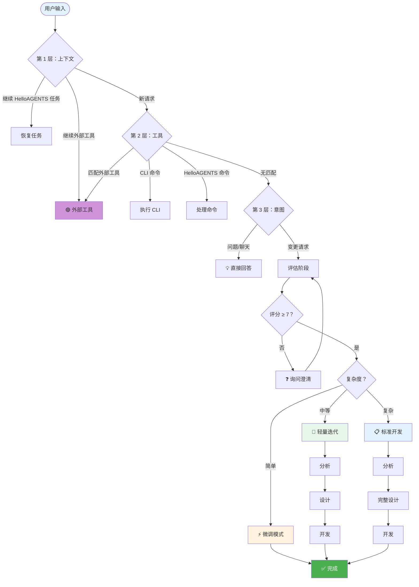

# HelloAGENTS

<div align="center">

**智能工作流系统 - 您的自主高级智能伙伴，自动分析、实现并验证直至完成。**

[](./helloagents/CHANGELOG.md)
[](./CONTRIBUTING.md)

</div>

<p align="center">
  <a href="./README.md"></a>
  <a href="./README_CN.md"></a>
</p>

---

## 📑 目录

<details>
<summary><strong>点击展开</strong></summary>

- [🎯 为什么选择 HelloAGENTS？](#-为什么选择-helloagents)
- [✨ 功能特性](#-功能特性)
- [🚀 快速开始](#-快速开始)
- [🔧 工作原理](#-工作原理)
- [📖 文档](#-文档)
- [❓ FAQ](#-faq)
- [🛠️ 故障排除](#-故障排除)
- [🆚 与其他方案对比](#-与其他方案对比)
- [📈 版本历史](#-版本历史)
- [🔒 安全](#-安全)
- [🙏 致谢](#-致谢)

</details>

---

## 🎯 为什么选择 HelloAGENTS？

**问题：** AI 编程助手通常止步于分析阶段，或在缺乏结构化工作流管理的情况下生成不一致的输出。

**解决方案：** HelloAGENTS 提供智能工作流系统，通过 3 层路由、4 阶段工作流和 3 层验收机制确保生产就绪的结果。

| 挑战 | 没有 HelloAGENTS | 有 HelloAGENTS |
|------|------------------|----------------|
| **输出不一致** | 取决于提示词质量 | G3 输出规则统一格式 |
| **过早终止** | 停在分析或部分实现阶段 | 完整执行直到验证完成 |
| **缺乏质量控制** | 需要人工审查 | 3 层验收（阶段/关卡/流程） |
| **上下文丢失** | 遗忘之前的决策 | 状态变量 + 知识库同步 |
| **风险管理** | 无安全检查 | EHRB 检测 + 2 层分析 |

### 💡 最适合

- ✅ **开发者** 寻求结构化的 AI 辅助开发工作流
- ✅ **团队** 需要一致的代码生成和文档
- ✅ **项目** 需要质量保证和风险管理
- ✅ **AI 辅助工作流** 不仅限于编码（文档、分析、规划）

### ⚠️ 不适合

- ❌ 简单的一次性代码片段（直接使用 AI 提示）
- ❌ 没有结构化需求的非技术任务
- ❌ 没有版本控制的项目

---

## ✨ 功能特性

### 🎯 核心能力

<table>
<tr>
<td width="50%">

**🧭 3 层智能路由**

- 上下文感知的对话延续
- 工具层支持 SKILL/MCP/Plugin 集成
- 意图分析与复杂度评估

**您的收益：** 自动路由到正确的工作流

</td>
<td width="50%">

**📚 4 阶段工作流引擎**

- 评估 → 分析 → 设计 → 开发
- 结构化推进与质量关卡
- 自动知识库同步

**您的收益：** 每次都能得到生产就绪的结果

</td>
</tr>
<tr>
<td width="50%">

**⚡ 3 层验收系统**

- 阶段级验证
- 阶段间质量关卡
- 流程级综合审查

**您的收益：** 一致的质量保证

</td>
<td width="50%">

**🛡️ EHRB 安全检测**

- 基于关键词的第一层扫描
- 语义分析第二层
- 风险时自动升级工作流

**您的收益：** 防范高风险操作

</td>
</tr>
</table>

### 📊 数据说话

- **3 层路由** — 上下文 → 工具 → 意图 分层处理
- **4 个工作流阶段** — 完整的开发生命周期覆盖
- **12 个命令** — 完整的命令集覆盖所有操作
- **44 个文件** — 模块化架构与参考库

---

## 🚀 快速开始

### 前置条件

- 支持 AGENTS.md/CLAUDE.md 配置的 AI CLI 工具（Claude Code、Codex CLI 等）
- 已安装并配置 Git

### 安装

**步骤 1：获取 HelloAGENTS**

```bash
git clone https://github.com/hellowind777/helloagents.git
cd helloagents
```

**步骤 2：复制文件到 CLI 配置目录**

本项目包含两部分，需要放置到不同位置：

| 源文件 | 目标位置 | 说明 |
|--------|----------|------|
| `helloagents/AGENTS.md` | `<CLI配置目录>/` | 主配置文件，放在配置根目录 |
| `helloagents/skills/helloagents/` | `<CLI配置目录>/skills/helloagents/` | 技能包，放在 skills 子目录 |

**如何确定 CLI 配置目录：**
- Claude Code: `~/.claude/`
- Codex CLI: `~/.codex/`
- 其他工具：请参考其文档

**示例（macOS/Linux 上的 Claude Code）：**

```bash
cp helloagents/AGENTS.md ~/.claude/
cp -r helloagents/skills/helloagents ~/.claude/skills/
```

**示例（Windows PowerShell 上的 Claude Code）：**

```powershell
Copy-Item helloagents\AGENTS.md $env:USERPROFILE\.claude\
Copy-Item -Recurse helloagents\skills\helloagents $env:USERPROFILE\.claude\skills\
```

**步骤 3：验证安装**

重启 AI CLI 并运行：

```
~help
```

**预期输出：**

```
💡【HelloAGENTS】- 帮助

### 可用命令

| 命令 | 功能 |
|------|------|
| ~auto | 全授权模式 |
| ~plan | 执行到设计阶段 |
| ~exec | 执行方案包 |
...

────
🔄 下一步: 输入命令或描述你的需求
```

### 首次使用示例

```bash
# 1. 获取帮助并查看可用命令
"~help"

# 2. 使用全授权模式开始
"~auto 实现用户认证功能"

# 3. 或者先使用规划模式
"~plan 添加深色模式支持"
```

---

## 🔧 工作原理

### 架构概览

<details>
<summary><strong>📊 点击查看完整架构图</strong></summary>



</details>

### 工作流阶段详解

<table>
<tr><th>阶段</th><th>功能</th><th>触发时机</th><th>输出</th></tr>

<tr>
<td><strong>评估</strong></td>
<td>
• 评估需求完整度<br>
• 询问澄清问题<br>
• 评估复杂度
</td>
<td>任何变更请求</td>
<td>
• 需求评分（≥7 才继续）<br>
• 复杂度评估<br>
• 工作流模式选择
</td>
</tr>

<tr>
<td><strong>分析</strong></td>
<td>
• 扫描项目结构<br>
• 识别技术栈<br>
• 检查知识库
</td>
<td>评分 ≥ 7</td>
<td>
• 项目上下文<br>
• 模块依赖<br>
• KB 状态
</td>
</tr>

<tr>
<td><strong>设计</strong></td>
<td>
• 创建方案包<br>
• 定义任务分解<br>
• 风险评估
</td>
<td>分析完成</td>
<td>
• proposal.md<br>
• tasks.md<br>
• 方案包
</td>
</tr>

<tr>
<td><strong>开发</strong></td>
<td>
• 执行任务<br>
• 生成代码<br>
• 运行验证
</td>
<td>设计通过</td>
<td>
• 代码变更<br>
• 测试结果<br>
• KB 同步
</td>
</tr>

</table>

> **注意：** 微调模式是简单变更的执行模式，不是工作流阶段。它绕过完整的 4 阶段工作流，用于快速单点修改。

---

## 📖 文档

### 核心概念

<table>
<tr><th>概念</th><th>定义</th><th>重要性</th></tr>

<tr>
<td><strong>方案包</strong></td>
<td>包含 proposal.md 和 tasks.md 的文件夹，用于功能开发</td>
<td>工作跟踪的核心单元</td>
</tr>

<tr>
<td><strong>知识库</strong></td>
<td>helloagents/ 目录下的项目文档</td>
<td>项目知识的唯一真相来源</td>
</tr>

<tr>
<td><strong>EHRB 检测</strong></td>
<td>极高风险行为检测系统</td>
<td>防止危险操作</td>
</tr>

<tr>
<td><strong>3 层验收</strong></td>
<td>阶段/关卡/流程 验证层级</td>
<td>每个层级的质量保证</td>
</tr>

</table>

### 命令参考

| 命令 | 模式 | 使用场景 | 示例 |
|------|------|----------|------|
| `~auto` | 全授权 | 端到端执行 | `~auto 添加登录功能` |
| `~plan` | 规划模式 | 仅设计，不执行 | `~plan 重构认证模块` |
| `~exec` | 直接执行 | 执行已有方案包 | `~exec` |
| `~init` | KB 管理 | 初始化知识库 | `~init` |
| `~upgrade` | KB 管理 | 升级知识库 | `~upgrade` |
| `~clean` | 维护 | 清理遗留方案包 | `~clean` |
| `~commit` | Git 操作 | 带检测的提交 | `~commit` |
| `~test` | 验证 | 运行项目测试 | `~test` |
| `~review` | 质量 | 代码审查 | `~review` |
| `~validate` | 质量 | 验证 KB 结构 | `~validate` |
| `~rollback` | 恢复 | 智能回滚 | `~rollback` |
| `~help` | 信息 | 显示帮助菜单 | `~help` |

### 配置

**全局设置（在 AGENTS.md 中）：**

```yaml
OUTPUT_LANGUAGE: zh-CN          # 输出语言
ENCODING: UTF-8                 # 文件编码
KB_CREATE_MODE: 2               # KB 模式：0=关闭, 1=按需, 2=编码任务自动创建, 3=始终
BILINGUAL_COMMIT: 1             # 双语提交：0=单语, 1=双语
```

**KB 创建模式：**
- `0 (OFF)`：跳过所有 KB 操作
- `1 (ON_DEMAND)`：仅在明确请求时创建 KB
- `2 (ON_DEMAND_AUTO_FOR_CODING)`：编码任务自动创建（默认）
- `3 (ALWAYS)`：始终创建/更新 KB

---

## ❓ FAQ

<details>
<summary><strong>Q：HelloAGENTS 与直接使用 AI 提示有何不同？</strong></summary>

**A：** HelloAGENTS 提供：
- 结构化 4 阶段工作流 vs. 临时响应
- 3 层路由智能处理请求
- 质量关卡和验收标准
- 知识库实现上下文持久化
- EHRB 安全检测
</details>

<details>
<summary><strong>Q：HelloAGENTS 可以与任何 AI CLI 工具一起使用吗？</strong></summary>

**A：** 是的，HelloAGENTS 设计为与任何支持 agent/skill 加载的 AI CLI 配合使用：
- Claude Code
- Codex CLI
- Gemini CLI
- 以及其他兼容工具
</details>

<details>
<summary><strong>Q：~auto 和 ~plan 有什么区别？</strong></summary>

**A：**
- `~auto`：全授权模式 - 静默执行所有阶段直到完成
- `~plan`：规划模式 - 在设计阶段后停止，等待审查后再执行
</details>

<details>
<summary><strong>Q：需要先初始化知识库吗？</strong></summary>

**A：** 不一定。使用 `KB_CREATE_MODE: 2`（默认），知识库会在编码任务时自动创建。您也可以使用 `~init` 显式创建。
</details>

<details>
<summary><strong>Q：如何处理遗留的方案包？</strong></summary>

**A：** 使用 `~clean` 扫描并清理 plan/ 目录中不完整或已废弃的方案包。
</details>

<details>
<summary><strong>Q：什么会触发 EHRB 检测？</strong></summary>

**A：** EHRB 检测触发条件：
- 生产环境关键词（prod、production、live、master）
- 破坏性操作（rm -rf、DROP TABLE 等）
- 不可逆操作（--force、--hard）
- 权限变更（chmod 777、sudo）
- 敏感数据模式（password、api_key 等）
</details>

<details>
<summary><strong>Q：可以自定义工作流吗？</strong></summary>

**A：** 可以，您可以修改 `references/` 中的参考模块来自定义阶段、规则和行为以满足特定需求。
</details>

<details>
<summary><strong>Q：v1 和 v2 有什么区别？</strong></summary>

**A：** 主要区别：

| 方面 | v1 (2025-12) | v2 (2026-01) |
|------|--------------|--------------|
| 定位 | AI 编程伙伴 | 智能工作流系统 |
| 阶段 | 3 阶段 | 4 阶段（+ 评估） |
| 路由 | 简单 | 3 层（上下文→工具→意图） |
| 验收 | 基础 | 3 层（阶段/关卡/流程） |
| 文件 | 6 个文件 | 44 个文件 |
| 命令 | 4 个命令 | 12 个命令 |
</details>

---

## 🛠️ 故障排除

### 路由问题

**问题：** 请求没有正确路由

**解决方案：**
```bash
# 检查 HelloAGENTS 是否已加载
"~help"

# 如果未加载，验证安装路径
# 检查 AI CLI 的 skill/agent 配置
```

---

**问题：** 外部工具未被识别

**原因：** 工具未正确注册或与 HelloAGENTS 命令冲突

**解决方案：**
```bash
# 使用显式工具调用语法
"/skill-name" 或 "$skill-name" 用于 SKILLs
"mcp://server" 用于 MCP
"@agent-name" 用于子代理
```

### 工作流问题

**问题：** 卡在评估阶段

**原因：** 需求评分低于 7

**解决方案：**
```bash
# 提供更具体的需求
# 回答澄清问题
# 或者覆盖：
"跳过评估继续执行"
```

---

**问题：** 方案包验证失败

**原因：** 缺少必需文件或格式错误

**解决方案：**
```bash
# 手动验证方案包
"~validate"

# 检查方案包结构：
# plan/YYYYMMDDHHMM_feature/
#   ├── proposal.md
#   └── tasks.md
```

### 知识库问题

**问题：** KB 没有被创建

**原因：** KB_CREATE_MODE 设置为 OFF 或模式错误

**解决方案：**
```bash
# 检查 AGENTS.md 中的当前模式
# KB_CREATE_MODE: 2 用于编码任务自动创建

# 或者显式初始化：
"~init"
```

---

**问题：** 执行了错误的方案包

**原因：** 状态变量未正确设置/清除

**解决方案：**
```bash
# 通过询问检查当前状态：
"当前的 CREATED_PACKAGE 和 CURRENT_PACKAGE 是什么？"

# 如果卡住，通过以下方式重置：
"取消当前操作并重新开始"
```

---

## 🆚 与其他方案对比

| 方案 | 优点 | 缺点 | HelloAGENTS 优势 |
|------|------|------|------------------|
| **原始 AI 提示** | 灵活 | 无结构，不一致 | 3 层路由 + 统一格式 |
| **Cursor / Copilot** | IDE 集成 | 无需求验证 | 10 分评分 + 3 层验收 |
| **自定义提示** | 量身定制 | 无状态管理 | 状态变量 + 方案包生命周期 |
| **AutoGPT** | 自主 | 黑盒决策 | 模块化参考 + 透明路由 |
| **Aider** | 重构好 | 仅 Unix，无阶段 | 跨平台 + 4 阶段工作流 |

---

## 📈 版本历史

### 最新版本：v2.0 (2026-01-16) 🎉

**定位演进：**
- 🔴 **系统重命名**：从"AI 编程模块化技能系统"到 **"智能工作流系统"**
- 🔴 **角色转变**：从"高级编程伙伴"到 **"高级智能伙伴"**
- 🔴 **范围扩展**：从编码扩展到通用 AI 辅助工作流

**重大架构升级：**
- 🔴 **模块化架构**：从 6 个文件扩展到 44 个文件，配有参考库
- 🔴 **4 阶段工作流**：新增评估阶段（微调是执行模式）
- 🔴 **3 层路由**：上下文 → 工具 → 意图 分层处理
- 🔴 **3 层验收**：阶段/关卡/流程 质量保证
- 🔴 **6 大核心原则**：新增"审慎验证"和"保守修改"
- ✨ **12 个命令**：完整命令集（~auto、~plan、~exec、~init、~upgrade、~clean、~commit、~test、~review、~validate、~rollback、~help）
- ✨ **23 个参考模块**：功能、阶段、规则、服务
- ✨ **7 个 Python 脚本**：方案包/KB 管理自动化工具
- ✨ **外部工具支持**：SKILL、MCP、plugins 集成
- ✨ **4 种 KB 创建模式**：灵活的知识库管理
- ✨ **两层 EHRB 检测**：关键词 + 语义分析
- ✨ **新目录结构**：skills/helloagents/ 包含 SKILL.md 和 SKILL.toml

**上一版本：v1.x (2025-12-18)**
- 初始发布为 AI 编程模块化技能系统
- 3 阶段工作流（分析 → 设计 → 开发）
- 4 个命令（~auto、~plan、~exec、~init）
- 6 个技能文件

[查看完整更新日志 →](./helloagents/CHANGELOG.md)

---

## 🔒 安全

**我们非常重视安全。**

- ✅ EHRB 检测防范高风险操作
- ✅ 两层分析（关键词 + 语义）
- ✅ 检测到风险时自动升级工作流
- ✅ 禁止硬编码密钥
- ✅ 跨平台命令验证

**发现漏洞？**
- 邮箱：security@helloagents.dev（私密披露）
- 请勿为安全漏洞创建公开 issue

---

## 🙏 致谢

**灵感来源：**
- AI CLI 生态系统（Claude Code、Codex CLI 等）
- Model Context Protocol (MCP)
- Keep a Changelog 格式

**社区：**
- 所有提交 PR 的贡献者
- 提供反馈的早期用户
- 以及您，感谢您阅读至此！🎉

---

## 📞 支持与社区

- 📖 **文档**：您正在阅读！
- 💬 **讨论**：[GitHub Discussions](https://github.com/hellowind777/helloagents/discussions)
- 🐛 **Bug 报告**：[GitHub Issues](https://github.com/hellowind777/helloagents/issues)
- 💡 **功能建议**：[GitHub Discussions](https://github.com/hellowind777/helloagents/discussions)

---

## 📜 许可证

本项目基于 [Apache-2.0 许可证](./LICENSE) 授权。

详见 [LICENSE](./LICENSE)。

---

<div align="center">

**Made with ❤️ by [Hellowind](https://github.com/hellowind777/helloagents)**

[⬆ 返回顶部](#helloagents)

</div>
